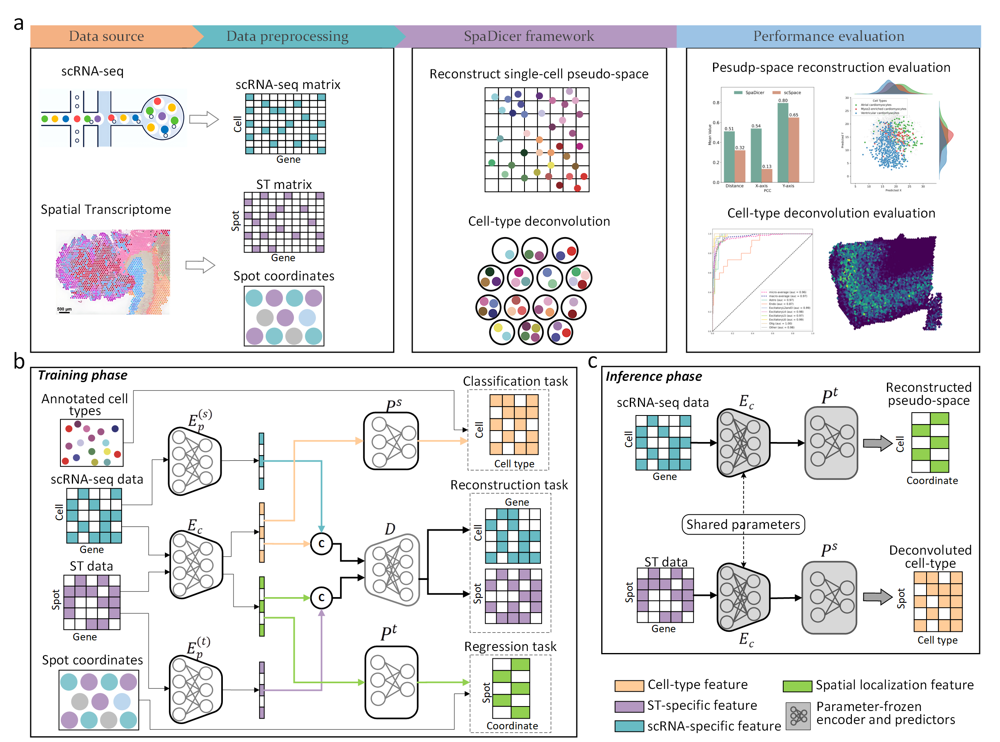

# Introduction

biSTAR integrates feature decoupling and multi-task learning to extract domain-invariant features, enabling simultaneous single-cell pseudo-spatial reconstruction and cell-type deconvolution for both single-cell and spatial transcriptomic data.	

# Model architecture



# Requirements

The deep learning models were trained on 2*NVIDIA GeForce RTX 4090 on linux.

+ Python 3.8.12
+ CUDA 11.3.1
+ PyTorch 1.0
+ Pandas 1.5.0
+ Numpy 1.24.4
+ Scikit-learn 1.1.2

# Usage

To setup the environment, install conda and run (Must run on servers with multiple GPUs):

```
conda create --name <your_env_name> --file requirements.txt
```

To train this model and obtain results, you need to download the dataset (Example: Dataset10), place it in the datasets folder, and then run:

```
python train.py
python val.py
```

If you want to change the hyperparameters, you need to modify the `config.py` script.

# Directory structure

+ `model`: contains the code for the model, the evaluation.
+ `configs.py`: Configuration for hyperparameters.
+ `data`: This directory needs to be created by yourself to store experimental data.
+ `utils.py`:Tools and methods required for training or validation.